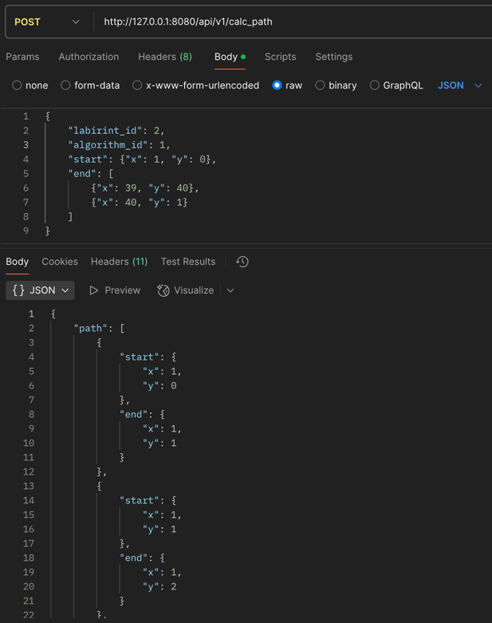
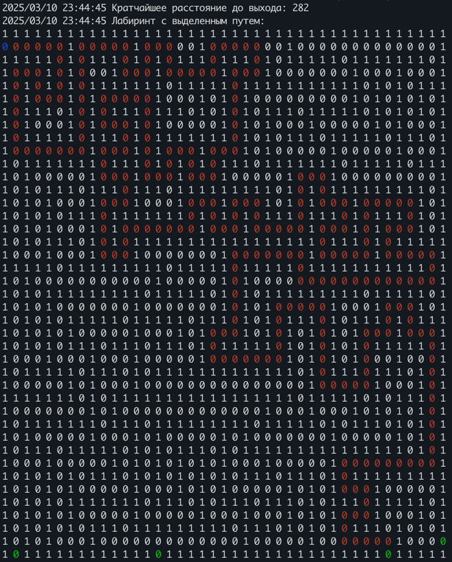

# Algo

Веб-сервис, который умеет запускать алгоритмы поиска кратчайшего пути в лабиринте, созданном на клетчатой доске.

Решается задача поиска кратчайшего пути из заданной стартовой клетки до любой из заданных конечных клеток.

## Запуск

```shell
docker-compose build
docker-compose up
```

или

```shell
docker-compose build
docker-compose up -d
```

Во втором случае логи не будет видно в stdout, можно посмотреть с помощью

```shell
docker logs main
```

## Взаимодействие с API

### Пример запроса

```shell
curl --location 'http://127.0.0.1:8080/api/v1/calc_path' \
--header 'Content-Type: application/json' \
--data '{
    "labirint_id": 2,
    "algorithm_id": 1,
    "start": {"x": 1, "y": 0},
    "end": [
        {"x": 39, "y": 40},
        {"x": 40, "y": 1}
    ]
}'
```



### Параметры запроса

Параметр `end` является опциональным. При его отсутствии в качестве конечных клеток будут выбраны все клетки на границе матрицы со значением `0`, отличные стартовой.

Параметр `labirint_id` может принимать значения:

- `1`: файл `maze/labyrinth_matrix_41x41.txt`
- `2`: файл `maze/labyrinth_matrix_41x41_many_targets.txt`

Параметр `algorithm_id` пока что может принимать только значение `1`, что соответсвует алгоритму `A*`.

## Визуализация работы

### Алгоритм A-star


